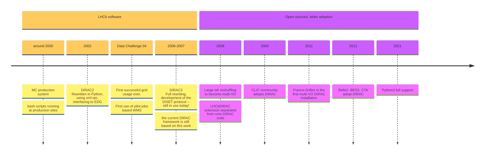
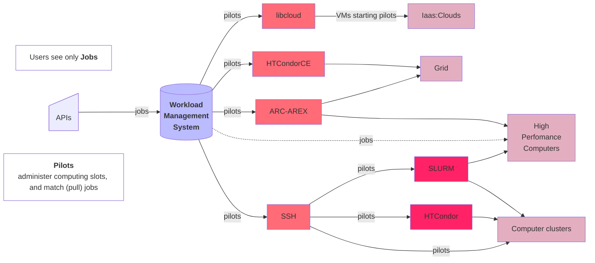
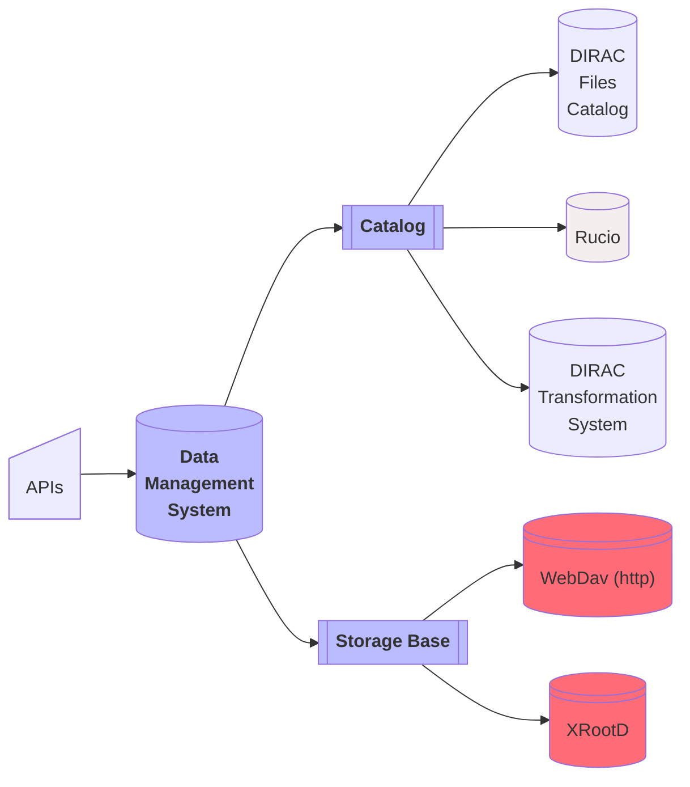
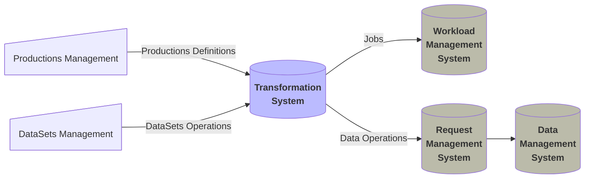
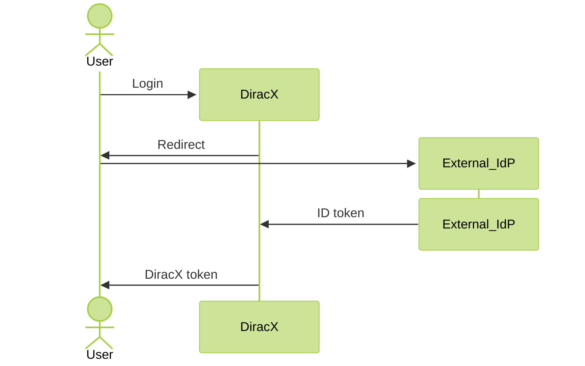
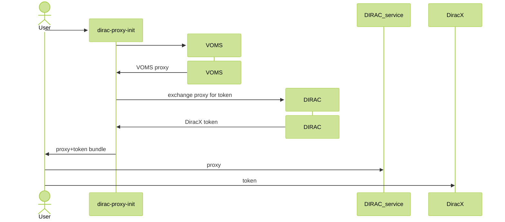
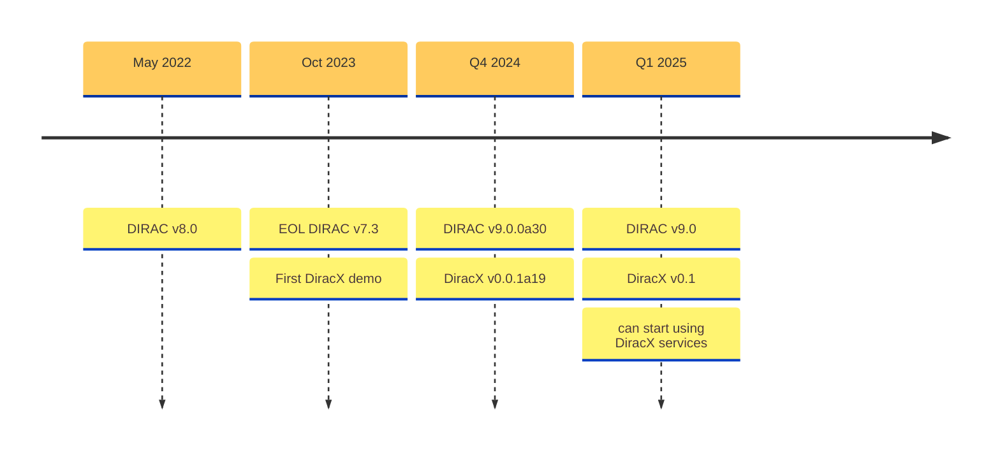

# Status of DIRACGrid project

**Federico Stagni** <Email v="federico.stagni@cern.ch" />

January 16th 2025
__ <a href="https://indico.cern.ch/event/1443765" class="ns-c-iconlink"><mdi-open-in-new />Dirac & Rucio mini-workshop and hackathon</a>  


<!-- 

-->


---
layout: section
color: lime-light
---

## This is the story of why and how we decided to take a successful project and rewrite its code from scratch


---
layout: section 
color: lime-light
---

<div style="display: flex; align-items: center; justify-content: center;">
    
    <span style="margin: 0 50px;">--></span>
    
</div>


<!-- 
This is not the first time that we rewrite DIRAC, but this time it is more profound, and to enforce this we decided to slightly change the name, adding a "fashionable" X at the end, and using a slightly different color scheme for the logo
-->


---
layout: section
color: cyan-light
---

## What is DIRAC?


---
layout: iframe-left
title: DIRAC
url: https://dirac.readthedocs.io/en/latest/
class: DIRAC
slide_info: false
color: gray-light
---

<div style="display: grid; grid-template-columns: repeat(auto-fill, minmax(90px, 1fr)); gap: 20px;">
  
  
  
  
  
  
  
  
  
  
  
  
  
  
  
  
  
  
</div>


<!-- 
"the grid is not anymore the grid", so now we just talk about "distributed heteroneous resources", including Grid, Cloud, HPC, etc.

I realised the other day that we do not explain well enough what "multi-VO" means: it means that DIRAC (and so "the grid") is offered "as a service", and this is a great solution for small and medium sized VOs
-->


---
layout: top-title
color: gray-light
align: c
title: Extensions
---

:: title ::

# Action! (and extensions)

:: content ::

Few real life examples, also reported in this conference:

<ul class="text-sm">
  <li>LHCb stores the metadata and provenance of every produced file in a LHCb-specific database (with an Oracle backend)
    <ul class="text-xs ml-4">
      <li>-->
        <a href="https://indico.cern.ch/event/1338689/contributions/6010069/" class="text-blue-600 hover:underline">see talk in Track 3 on Monday</a> and poster #461 on <code>LbMCSubmit</code>
      </li>
    </ul>
  </li>
  <li>Belle2 is a HEP experiment. Uses Rucio as a data management solution.
    <ul class="text-xs ml-4">
      <li>--> <a href="https://indico.cern.ch/event/1338689/contributions/6010888/" class="text-blue-600 hover:underline">see talk in Track 1 this afternoon</a></li>
    </ul>
  </li>
  <li>CTAO has radically different requirements (compared to HEP experiments) on how to process its data.
    <ul class="text-xs ml-4">
      <li>--> <a href="https://indico.cern.ch/event/1338689/contributions/6011028/" class="text-blue-600 hover:underline">see talk in Track 4 tomorrow</a></li>
    </ul>
  </li>
  <li>HERD is an astronomy and particle astrophysics experiment using dHTC for data management.
    <ul class="text-xs ml-4">
      <li>--> <a href="https://indico.cern.ch/event/1338689/contributions/6011011/" class="text-blue-600 hover:underline">see talk in Track 4 tomorrow</a></li>
    </ul>
  </li>
  <li>EGI uses DIRAC as WMS, and EGI-CheckIn as an identity provider. Hosts (among others) WeNMR (structural biology and life science)</li>
</ul>

<SpeechBubble position="t" color='amber' shape="round"  v-drag="[350,430,250,80]">
DIRAC is coded for being flexible and extendable 
</SpeechBubble>


---
layout: top-title
color: gray-light
align: c
title: history
---

:: title ::

# DIRAC timeline

:: content ::




---
layout: side-title
align: lm-lm
color: gray-light
title: WMS
titlewidth: is-3
---

:: title ::

## Workload Management System
- Pull model based on Pilot jobs
- Also "Push" solution for HPCs that do not support pilots (because of limited internet access).
- Will integrate [CWL (Common Workflow Language)](https://www.commonwl.org) as a way of defining jobs (replacing JDL) --> see poster #217

:: content ::



---
layout: side-title
align: lm-lm
color: gray-light
title: DMS
titlewidth: is-5
---

:: title ::

## Data Management System
It’s about **files**:​ placing, replicating, removing files​

- there are **LFNs** (logical file names)
- **LFNs** are registered in *catalog(s)​*
    - where are the LFNs? (in the DIRAC File Catalog (DFC), or in Rucio)​
    - where are their metadata? (in the DFC, or in the LHCb Bookkeeping, or in AMGA)​
- LFNs *may* have **PFNs** (physical file names), stored in **SEs** (Storage Elements), that can be accessed with several protocols.​

:: content ::



<!-- 
A catalog is effectively an interface, that needs implementation. Such implementation can be the DIRAC Files Catalog, or Rucio, or any other, including extension specific ones
-->


---
layout: side-title
color: gray-light
align: lm-lm  
title: TS
---

:: title ::

## Transformation System
### For productions and Dataset management

- A *Data Processing* **transformation** (e.g. Simulation, Merge, DataReconstruction...) creates jobs in the WMS (and re-submits them if needed, eventually destroys them).​

- A *Data Manipulation* **transformation** replicates, or removes, data from storage elements.

:: content ::

<span class="bg-cyan-100 text-cyan-600 p-4 border-l-6 border-2 border-cyan-400 rounded-lg pl-8 pr-8 w-full block">
The Transformation System is used to automate common tasks related to production activities. It can handle thousands of productions, millions of files and jobs.
</span>

&nbsp;
&nbsp;



---
layout: top-title-two-cols
align: c-ct-ct
color: gray-light
title: Web
---


:: title ::

# Visualizations 

:: left :: 

DIRAC also provides a WebApp: 


:: right ::

Dashboards can be created within the DIRAC Web App:


and/or in Grafana:


---
layout: top-title
align: c
color: gray-light
title: DIRAC tech
---


:: title ::

# Technicalities

:: content :: 

<ul class="text-sm">
  <li>DIRAC is written in python 3 (the Pilot still supports Python 2.7)</li>
  <li>Services are exposed at urls like <code>dips://box.some.where:9132/WorloadManagement/</code>
    <ul class="text-xs">
      <li><code>dips</code> stands for "DIRAC protocol"</li>
    </ul>
  </li>
  <li>The DIRAC framework provides also "Agents" (~ cron jobs) and "Executors" (~ tasks execution) to animate the system</li>
  <li>As backends, <logos-mysql class="text-2xl align-middle inline-block mx-0"></logos-mysql> and <logos:opensearch class="text-1xl align-middle inline-block mx-0"></logos:opensearch> are supported (for different purposes)</li>
  <li>The Web App is implemented using <code>ExtJS</code>, and fully custom Python "bindings"</li>
  <li>For its internal AuthN/Z, DIRAC understands certificates and proxies
    <ul class="text-xs">
      <li>VOMS (Virtual Organization Membership Service) is effectively a hard DIRAC dependency</li>
    </ul>
  </li>
</ul>


---
layout: top-title-two-cols
align: c-lm-lt
color: gray-light
title: world
---

<StickyNote color="gray-light" textAlign="center" width="260px" title="Dirac should follow these trends" v-drag="[550,380,320,100]">
What is the best way to keep up with these trends? Can we do it within the current framework?
</StickyNote>


:: title ::

## Technology trends

:: left ::

You authenticate with an external "Identity provider":


For authorization purposes you are using tokens everywhere:


:: right ::

(Nicely documented) REST APIs are a de-facto standard:

```sh
# "get a tag" from github

curl -L \
  -H "Accept: application/vnd.github+json" \
  -H "Authorization: Bearer <YOUR-TOKEN>" \
  -H "X-GitHub-Api-Version: 2022-11-28" \
  https://api.github.com/repos/OWNER/REPO/git/tags/TAG_SHA
```

---
layout: top-title
align: c
color: gray-light
title: wlcg
---

<StickyNote color="gray-light" textAlign="center" width="260px" title="Dirac needs to follow these recommendations" v-drag="[570,400,320,120]">
What is the best way to implement these recommendations? Can we do it within the current framework?
</StickyNote>


:: title ::

## Recommendations from WLCG, EGI, etc.


:: content ::

- VOMS (Virtual Organization Membership Service) has been, for many years, a de-facto standard for **community management**
  - it issues VOMS proxies ("short" certificates)
  - Outside of WLCG and EGI, proxies are not a thing
- --> There are new Identity Providers delivering tokens instead of proxies

&nbsp;

In this conference:

- <a href="https://indico.cern.ch/event/1338689/contributions/6010716/" class="text-blue-600 hover:underline">WLCG transition from X.509 to Tokens: Progress and Outlook</a>
- <a href="https://indico.cern.ch/event/1338689/contributions/6011018/" class="text-blue-600 hover:underline">CMS Token Transition</a>
- <a href="https://indico.cern.ch/event/1338689/contributions/6011022/" class="text-blue-600 hover:underline">Fermilab's Transition to Token Authentication</a>


---
layout: top-title-two-cols
color: gray-light
align: c-rt-lt
title: requirements
---

<StickyNote color="gray-light" textAlign="center" width="260px" title="Developers and maintainers requirements" v-drag="[350,300,320,100]">
Easy to test (will make it easier to code), but also modern, fun, and accessible to new developers
</StickyNote>

<StickyNote color="amber-light" textAlign="center" width="260px" title="Paramount requirement" v-drag="[365,420,290,70]">
We need to ensure business continuity
</StickyNote>


:: title ::

# Minimum Requirements

:: left ::

## Communities/Users requirements

Ease of use, including ease of access

Fast and responsive interfaces

Scalable and flexible

:: right ::

## Administrator requirements

Ease of installation and update

Up-to-date documentation

Clear confguration

Ready-to-use dashboards


---
layout: side-title
align: rm-lm
color: red
titlewidth: is-2
title: issues
--- 

:: title ::

# DIRAC challenges

:: content ::

<ul class="list-image-none font-sans text-sm mx-auto">
    <li> complex, with high entrance bar</li>
    <li> somewhat cumbersome deployment</li>
    <li> late on “standards”
        <ul class="text-xs mx-auto">
            <li> No http services</li>
            <li> No tokens</li>
            <li> Old monitoring</li>
        </ul>
    </li>
    <li> "old"-ish design (RPC, "cron" agents...)</li>
    <li> not very developer-friendly: rather un-appealing/confusing, especially for new (and young) developers</li>
    <li> multi-VO, but was not designed to do so since the beginning</li>
    <li> a custom interface is needed to interact with a running DIRAC instance
        <ul class="text-xs mx-auto">
            <li> meaning that you need to install a DIRAC client for interacting with DIRAC</li>
        </ul>
    </li>
</ul>


---
layout: section
color: lime-light
---

## We decided that the best way of satisfying the requirements was to code a new Dirac


---
layout: section
color: cyan-light
--- 

## DiracX,  the neXt DIRAC incarnation


---
layout: side-title
side: left
color: gray-light
titlewidth: is-5
align: rm-lm
title: DiracX
---

:: title ::

# What is DiracX?

:: content ::

- A cloud native app
- Multi-VO from the get-go
- Standards-based

<AdmonitionType type='important' >
Still Dirac, in terms of functionalities.
</AdmonitionType>


---
layout: iframe-right
title: Web API
url: https://diracx-cert.app.cern.ch/api/docs
class: webAPI
slide_info: false
color: gray-light
align: lm
---

# DiracX Web API


<AdmonitionType type='caution' >
What is on the right is the certification Web API, loaded live. Use with caution!
</AdmonitionType>

DIRAC Web APIs with <devicon-fastapi-wordmark class="text-7xl align-middle inline-block mx-0"></devicon-fastapi-wordmark>

<ul class="text-sm">
  <li>
    Nicely documented by 
    <devicon-swagger-wordmark class="text-7xl align-middle inline-block mx-0"></devicon-swagger-wordmark>
    <ul class="text-xs ml-4">
      <li class="text-xs">--> this is what you see on the right</li>
    </ul>
  </li>
  <li>
    Follows the <devicon-plain-openapi-wordmark class="text-7xl align-middle inline-block mx-1"></devicon-plain-openapi-wordmark> specification, with the (python) client generated by <a href="https://github.com/Azure/autorest/blob/main/docs/introduction.md">AutoREST</a>.
  </li>
</ul>


<!-- 
- there is also redoc
- AutoREST supports several langagues, not only python
-->


---
layout: top-title
color: gray-light
align: c
title: CLI
---

:: title ::

# CLI Interactions

:: content ::

1. Logging in (using the `diracx cli`):

```bash
❯ dirac login gridpp
Logging in with scopes: ['vo:gridpp']
Now go to: https://diracx-cert.app.cern.ch/api/auth/device?user_code=XYZXYZXYZ
...Saved credentials to /home/fstagni/.cache/diracx/credentials.json
Login successful!
```

2. Submitting a job (using Python `requests`):

```python
import requests

requests.post('https://diracx-cert.app.cern.ch/api/jobs/', headers={'accept': 'application/json', 'Authorization': 'Bearer eyJhbG...', 'Content-Type': 'application/json'}, json=jdl)
```

3. Getting its status (using `curl`):

````md magic-move
```bash
curl -X 'GET' \
  'https://diracx-cert.app.cern.ch/api/jobs/status?job_ids=8971' \
  -H 'accept: application/json' \
  -H 'Authorization: Bearer eyJhbG...'  | jq
```
```json
{
  "8971": {
    "Status": "Done",
    "MinorStatus": "Execution Complete",
    "ApplicationStatus": "Unknown"
  }
}
```
````


---
layout: iframe-left
title: WebApp
url: https://diracx-cert.app.cern.ch
class: webapp
slide_info: false
color: gray-light
align: lm
---

# DiracX web

We are also rewriting [the Web App](https://github.com/DIRACGrid/diracx-web) from scratch.

Software stack:
- NextJS <devicon-nextjs-wordmark class="text-4xl align-middle inline-block mx-2" />
- Material UI <devicon-materialui class="text-3xl align-middle inline-block mx-2" />
- TypeScript <devicon-typescript class="text-3xl align-middle inline-block mx-2" />

<AdmonitionType type='caution' >
What is on the left is the certification WebApp, loaded live. Use with caution!
</AdmonitionType>

---
layout: top-title-two-cols
color: gray-light
align: c-lm-lm
title: Deployments
---

:: title :: 

# Deployments

:: left ::

Kubernetes - <devicon-kubernetes class="text-3xl align-middle inline-block mx-0"></devicon-kubernetes> Standard to define a distributed system

<ul class="text-sm">
  <li>Separates infrastructure from applications
    <ul>
      <li class="text-xs">"Please IT department(/cloud provider) run this for me"</li>
    </ul>
  </li>
</ul>


Helm <devicon-helm class="text-3xl align-middle inline-block mx-0"></devicon-helm> gives the ability:

<ul class="text-sm">
  <li>to parameterise</li>
  <li>to distribute a kubernetes config</li>
</ul>

:: right ::

<ul class="text-sm">
  <li><a href="https://github.com/DIRACGrid/diracx-charts">DiracX Helm chart</a>
    <ul>
      <li>If your institution provides a kubernetes service: use it</li>
      <li>If you work with public clouds: use their container services</li>
      <li>Alternatively, follow these <a href="https://github.com/DIRACGrid/diracx-charts/tree/master/k3s">k3s instructions</a></li>
    </ul>
  </li>
  <li>Used for:
    <ul>
      <li>DiracX testing (GitHub actions)</li>
      <li>Local development instance</li>
      <li>Running a demo instance</li>
      <li>Running the test instance you saw in the previous slides</li>
      <li>Soon: running production instances</li>
    </ul>
  </li>
</ul>


---
layout: quote
color: sky-light
quotesize: text-m
authorsize: text-s
author: 'Some of you out there'
---

"OK, but there are several communities using DIRAC right now. How do they migrate?"

---
layout: top-title
color: gray-light
align: c
title: Migration
---

:: title ::

### Business continuity for DIRAC communities is our top priority
Services of DIRAC v9 and DiracX will need to live together for some time


:: content ::

<Arrow x1="300" y1="170" x2="370" y2="170" />
<Line :x1=345 :y1=200 :x2=345 :y2=500 :width=1 />

<Arrow x1="610" y1="170" x2="680" y2="170" />
<Line :x1=633 :y1=200 :x2=633 :y2=500 :width=1 />

<div style="display: flex; align-items: center; justify-content: center;">
     </img>
     </img>
     </img>
</div>

<SpeechBubble position="r" color='cyan' shape="round"  v-drag="[100,350,40,60]">
1
</SpeechBubble>

<SpeechBubble position="r" color='cyan' shape="round"  v-drag="[370,350,40,60]">
2
</SpeechBubble>

<SpeechBubble position="r" color='cyan' shape="round"  v-drag="[660,350,40,60]">
3
</SpeechBubble>

<SpeechBubble position="t" color='amber' shape="round"  v-drag="[160,350,120,180]">
DIRAC and DiracX share the databases
</SpeechBubble>

<SpeechBubble position="t" color='amber' shape="round"  v-drag="[430,350,160,180]">
A legacy adaptor moves traffic from DIRAC to DiracX services
</SpeechBubble>

<SpeechBubble position="t" color='amber' shape="round"  v-drag="[720,350,120,140]">
DIRAC services can be removed
</SpeechBubble>

---
layout: top-title
color: gray-light
align: c
title: FutureExtensions
---

:: title ::

# Future action! (and extensions)

:: content ::

<span class="bg-cyan-100 text-cyan-600 text-center p-4 border-l-6 border-2 border-cyan-400 rounded-lg pl-8 pr-8 w-full block">
    By now, we know that it is sometimes necessary to extend all Dirac(X) components 
    
    DiracX aims to provide an easy way to do so.
</span>


```toml
# entrypoints in pyproject.toml

[project.entry-points."diracx.db.sql"]
AuthDB = "diracx.db.sql:AuthDB"
JobDB = "<extension>.db.sql:ExtendedJobDB"
```

<SpeechBubble position="t" color='amber' shape="round"  v-drag="[400,310,220,140]">
For DiracX and DiracX-Web we already provide reference extensions
</SpeechBubble>


---
layout: quote
color: sky-light
quotesize: text-m
authorsize: text-s
author: 'Again, some of you out there'
---


"You have shown tokens-based authorizations for DiracX. But the Grid still uses proxies. 

VOMS is alive!"

---
layout: top-title
color: gray-light
align: c
title: tokens
---

:: title ::

# What are proxies and/or tokens needed for?

:: content ::

- **Identity (community membership)**: "in transition"
- **Submitting pilots**: The computing elements right now prefer the tokens
- **Data access**: at least in WLCG, proxies. One day, will be token
- **Verifying a user's identity** (internally to Dirac): 
    - **DiracX** uses only tokens ([link to security model](https://github.com/DIRACGrid/diracx/blob/main/security_model.md))
    - **DIRAC** uses only X509 proxies and certificates to verify identities 


---
layout: top-title-two-cols
color: gray-light
align: c-cm-cm
title: proxies+tokens
columns: is-2
---

:: title ::

# More on proxies and tokens

:: left :: 

DiracX: Authorization with "standard" <a href="https://auth0.com/docs/get-started/authentication-and-authorization-flow/authorization-code-flow" class="text-blue-600 hover:underline">Authorization Code Flow</a> redirecting to IdP



<AdmonitionType type='Note' >
DiracX delivers its own tokens, they are not the same tokens used for the Grid endpoints
</AdmonitionType>


:: right ::

DIRAC+DiracX: working with proxies and tokens



<Line :x1=420 :y1=120 :x2=420 :y2=520 :width=1 />


---
layout: side-title
color: gray-light
title: Architecture
align: cm-lm
titlewidth: is-3
---


:: title ::

# Architecture diagram

:: content ::

 </img>

---
layout: top-title
color: gray-light
align: c
title: Versions
---

:: title ::

# Versions

:: content ::



<SpeechBubble position="r" color='cyan' shape="round"  v-drag="[20,211,148,240]">
Current production and only supported version, used by all DIRAC installations
</SpeechBubble>


<SpeechBubble position="l" color='amber' shape="round"  v-drag="[820,265,140,175]">
DIRAC v9 and DiracX 0.1 will be released together.
</SpeechBubble>


---
layout: side-title
color: gray-light
title: Contribute
align: cm-lm
titlewidth: is-3
---

:: title ::

# *"I want to contribute"*

:: content ::

## The obvious ways:

<ul class="text-sm">
    <li>
        <a href="https://github.com/DIRACGrid/diracx" class="text-blue-600 hover:underline">code (github.com/DIRACGrid)</a>
    </li>
    <li>
        tests: (as you could see we have a somewhat open test deployment infrastructure). Try something out, and let us know!
    </li>
</ul>

**Run the demo (on your laptop):**

```sh
git clone https://github.com/DIRACGrid/diracx-charts
diracx-charts/run_demo.sh # this is run for each and every commit in Github Actions
```
 

## Discuss:
<ul class="text-sm">
  <li><strong>mattermost</strong>: <a href="https://mattermost.web.cern.ch/diracx/" class="text-blue-600 hover:underline">https://mattermost.web.cern.ch/diracx/</a></li>
  <li><strong>meetings</strong>: (almost) every week on Thursday morning (CET)</li>
  <li><strong>hackathons</strong>: we have been doing 2-days DiracX hackathons every quarter, at CERN
    <ul class="text-xs ml-4">
      <li>--> <a href="https://indico.cern.ch/event/1458873/" class="text-blue-600 hover:underline">Next one in January</a></li>
      <li>--> <a href="https://indico.cern.ch/event/1443765/" class="text-blue-600 hover:underline">Followed by a Dirac&Rucio mini-workshop and hackathon</a></li>
    </ul>
  </li>
  <li><strong>workshops</strong>: once per year, more or less
    <ul class="text-xs ml-4">
      <li>--> <a href="https://indico.cern.ch/event/1433941/" class="text-blue-600 hover:underline">Next one in September 2025, in Beijing</a></li>
    </ul>
  </li>
</ul>


<!-- 
- You might have seen that we set up 2 VOs: **gridpp** and **dteam**. For **dteam** we do not import all members, but if you want to...
-->


---
layout: top-title-two-cols
align: cm-cm-lm
color: orange-light
columns: is-4
title: summary
--- 
:: title ::

# Summary

:: left :: 

 </img>

:: right ::

<ul class="text-base">
  <li>DiracX is "the neXt Dirac incarnation", ensuring the future of the widely used Dirac
    <ul class="text-sm">
      <li>We are rewriting the code, but it is still Dirac that you love!</li>
    </ul>
  </li>
  <li>DiracX will ease the interoperability with Rucio and/or dask and/or any other tool out there
    <ul class="text-sm">
      <li>DiracX will still have the Data Management part, but its Workload Management functionalities will come first</li>
    </ul>
  </li>
  <li>The first DiracX release will soon be here
    <ul class="text-sm">
      <li>It will live together with DIRAC v9 for a while, until it will replace it completely</li>
    </ul>
  </li>
</ul>


---
layout: credits
color: navy
loop: true
speed: 0.5
title: credits/people
---

<div class="grid text-size-4 grid-cols-3 w-3/4 gap-y-10 auto-rows-min ml-auto mr-auto">
    <div class="grid-item text-center mr-0- col-span-3">
        <strong>People</strong><br> 
    </div>
    <div class="grid-item text-right mr-4 col-span-1">
        <strong>DiracX is an idea of</strong>
    </div>
    <div class="grid-item col-span-2">
        Chris Burr <i>CERN, LHCb</i><br/>
        Christophe Haen <i>CERN, LHCb</i>
    </div>
    <div class="grid-item text-right mr-4 col-span-1">
        <strong>Current Developers, maintainers, supporters</strong>
    </div>
    <div class="grid-item col-span-2">
        Alexandre Boyer <i>CERN, LHCb</i><br/>
        Natthan Piggoux <i>LUPM (FR), CTA</i><br/>
        Cedric Serfon <i>Brookhaven National Laboratory (US), Belle2</i><br/>
        Ryunosuke O'Neil <i>CERN, LHCb</i><br/>
        Jorge Lisa Laborda <i>Univ. of Valencia and CSIC (ES), LHCb</i><br/>
        Daniela Bauer <i>Imperial college (UK), GridPP</i><br/>
        Simon Fayer <i>Imperial college (UK), GridPP</i><br/>
        Janusz Martyniak <i>Imperial college (UK), GridPP</i><br/>
        Bertrand Rigaud <i>IN2P3 (FR)</i><br/>
        Luisa Arrabito <i>LUPM (FR), CTA</i><br/>
        Xiaomei Zhang <i>Beijing, Inst. High Energy Phys. (CN), Juno</i><br/>
        André Sailer <i>CERN</i>
    </div>
    <div class="grid-item text-right mr-4 col-span-1">
        <strong>Project lead</strong>
    </div>
    <div class="grid-item col-span-2">
        Federico Stagni <i>CERN, LHCb</i><br/>
        Andrei Tsaregorotsev <i>CPPM (FR), EGI and LHCb</i>
    </div>
</div>

&nbsp;
&nbsp;
&nbsp;
&nbsp;
&nbsp;
&nbsp;
&nbsp;
&nbsp;

<div class="grid-item col-span-3 text-center mt-180px mb-auto font-size-1.5rem">
    <strong>Questions?</strong>
</div>

<!-- 
This is not a fully exhastive list (of developers)
-->


---
layout: side-title
align: rm-lm
color: light
titlewidth: is-5
title: QR
--- 

:: title ::

# QR codes for your fun

# <mdi-arrow-right />

or just click [here (for DiracX web)](https://diracx-cert.app.cern.ch) and [here (for the Web API docs)](https://diracx-cert.app.cern.ch/api/docs)

:: content ::

WebApp:

<QRCode value="https://diracx-cert.app.cern.ch" :size="180" render-as="svg" />

<br />

WebAPI:

<QRCode value="https://diracx-cert.app.cern.ch/api/docs" :size="180" render-as="svg" />

<br />


---
layout: section
color: cyan-light
align: r
---

## Backup

---
layout: top-title
color: gray-light
align: c
title: FAQ
---

:: title :: 

Q/A

:: content ::

- I am using {Rucio|dask|another_tool}. I could use DiracX as WMS but do not want to fiddle with DIRAC

--> It will probably be possible, but we do not know when.

- What is in a DiracX token (is it "special")?

--> It carries the `dirac_properties` (which are the same as in current DIRAC)


&nbsp;
&nbsp;
&nbsp;
&nbsp;
&nbsp;
&nbsp;

- What did you use to make these slides?

--> [slidev](https://sli.dev/) with [neversink theme](https://gureckis.github.io/slidev-theme-neversink). Diagrams with [mermaid](https://mermaid.js.org)


---
layout: top-title
color: gray-light
align: c
title: tests
---

:: title :: 

# Testing

:: content ::

- we use Github Actions "massively"
- our Integration tests create a "grid-in-a-box":
  - run DIRAC and DiracX servers, including databases
  - run ancillary services (e.g. IdP, CA)
  - authenticate, submit pilots, match and run jobs, upload files, etc
